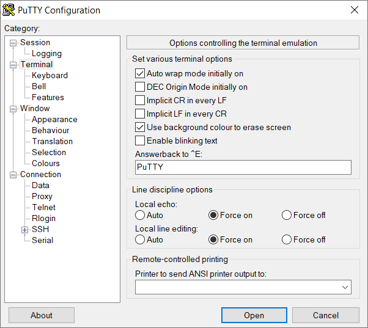

# Getting Started

1. Compile the code.

2. Download the code to the development board.

3. Use a micro USB cable to connect the development board and your computer.

4. Identify the COM/serial port that identifies the development board. On Windows, you can use **Device Manager**.

4. Install **Putty**. Use the following pictures to change Putty settings.

Set the communication parameters:

Set the display parameters:

# Commands You Can Play With

1. Any string starts with **q**. The response will be **you typed q\r\n**.

2. Any string starts with **w**. The response will be **you typed w\r\n**.

3. For any other strings, the response will repeat what you have sent over USB.

Happy hacking!